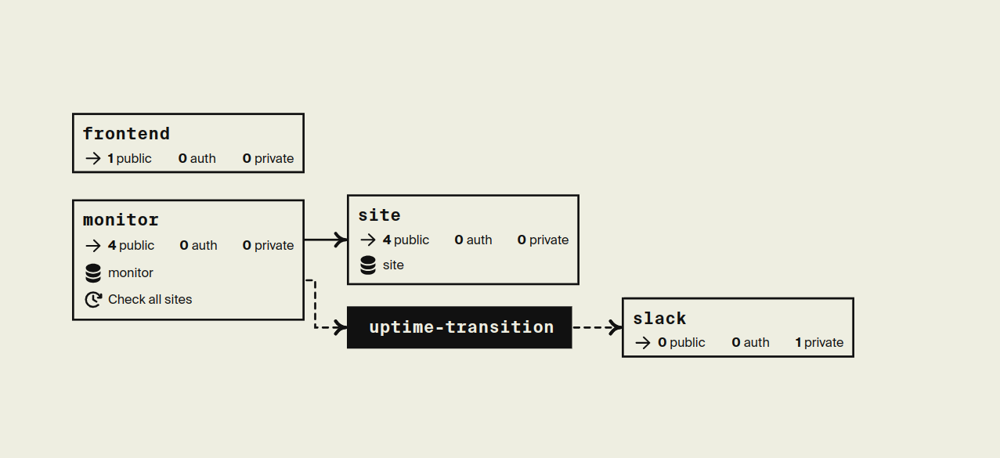
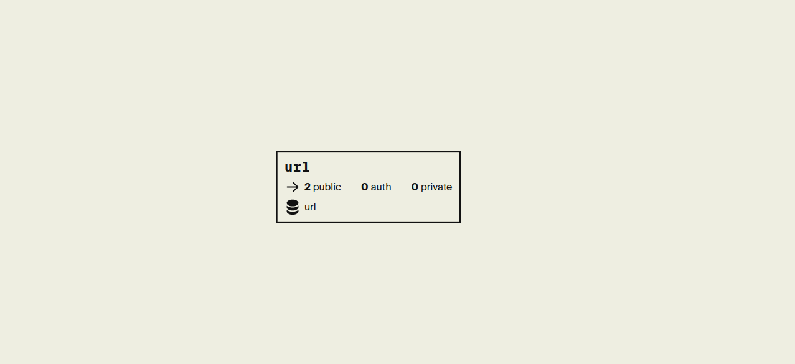
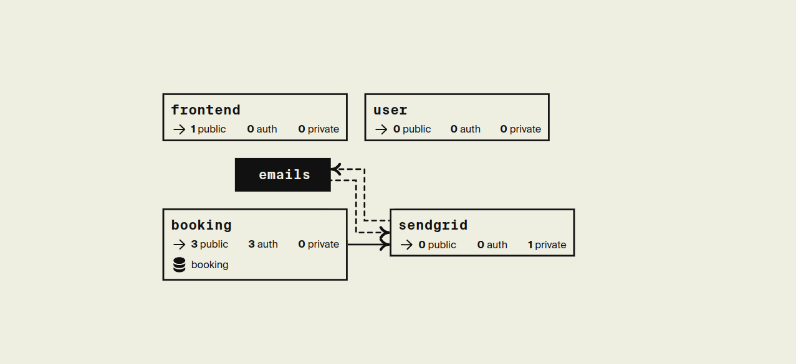
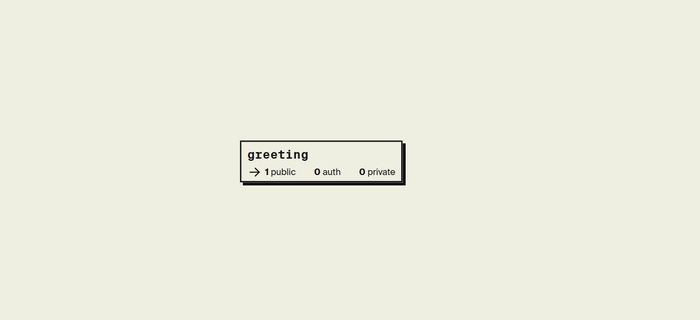
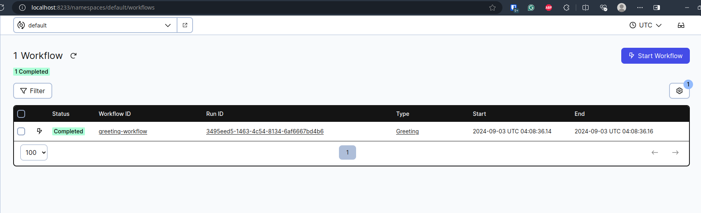

# Encore test project

## 1. Prerequisites 
Install the following:
1. Go [Download](https://go.dev/dl/)
2. Encore [Link](https://encore.dev/docs/install)
3. Docker [Link](https://docs.docker.com/engine/install/ubuntu/)
4. Temporal [Link](https://docs.temporal.io/cli)


### Project Overview
This project is built using Encore, a Go framework for cloud backend development. It includes three demo projects:

- Uptime Monitoring: Monitors the uptime of various services.

- REST API: Demonstrates a RESTful API service.

- Booking System: A simple booking system for managing reservations.

- Temporal



## Installation 
1. Clone the Repository

```shell
git clone git@github.com:yogenpoonudurai/encore-test-projects.git
cd encore-test-projects
```
2. Install Dependencies Encore will automatically manage dependencies for you. Simply navigate to the project directory.

3. Running the Project
Run using the Encore CLI.

```shell
encore run
```


## How to deploy your own Docker images
Self host [Link](https://encore.dev/docs/how-to/self-host)
1. Eject
```shell
encore eject docker MY-IMAGE:TAG
```
2. Set up runtime configurations
3. Export secrets
